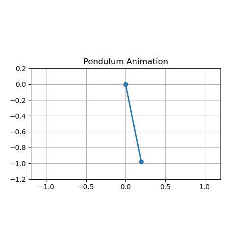
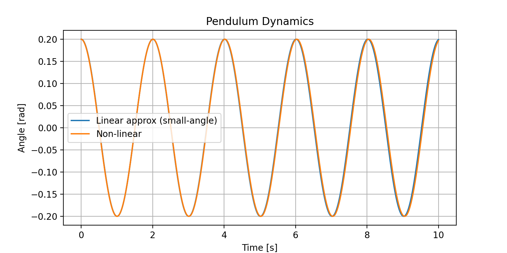

# Pendulum-Dynamics-Simulation

**Abstract**

This script models the motion of a simple pendulum using two approaches: the analytical small-angle approximation and a full nonlinear integration of the pendulum equation. It computes and plots the angular displacement over time for both cases, highlighting the divergence between linear theory and exact behavior at larger amplitudes. Additionally, it generates a frame-by-frame animation of the pendulum’s swing, illustrating the real-time trajectory in two dimensions. All outputs, including a comparison plot and an animated GIF, are saved to a dedicated `figures_pendulum` directory for easy review and presentation.

# README.md

# Pendulum Dynamics Visualization

A Python script to compare and animate the motion of a simple pendulum under small-angle approximation versus the full nonlinear model.

## Features

- Analytical solution under the small-angle approximation  
- Numerical solution of the full nonlinear pendulum equation via explicit Euler  
- Comparison plot of angle versus time for both models  
- Animated pendulum swing saved as a GIF
  

## Equations of Motion

- Small-angle (linear) approximation:  
  $$\[
    \frac{d^2\theta}{dt^2} + \frac{g}{L}\,\theta = 0
  \]$$

- Full nonlinear model:  
  $$\[
    \frac{d^2\theta}{dt^2} + \frac{g}{L}\,\sin(\theta) = 0
  \]$$

Here, $$\(g\)$$ is gravitational acceleration and $$\(L\)$$ is the pendulum length.

## Dependencies

- Python 3.6 or higher  
- numpy  
- matplotlib  
- pillow (for GIF export)  

Install via pip:

pip install numpy matplotlib pillow

## Installation

3. Install required packages:  

pip install numpy matplotlib pillow
 
## Usage

Run the visualization script directly:

PendulumDynamics Simulation.py

## Customization

Modify parameters at the top of the script

-g – gravitational acceleration (m/s²)  
- L – pendulum length (m)  
$$\theta$$– initial angle (rad)  
- $$\omega$$ – initial angular velocity (rad/s)  
- dt – simulation time step (s)  
- T_total– total duration of simulation (s)  

Adjust axis limits or styling in the plotting sections for bespoke visualizations.

## License

This project is released under the MIT License

